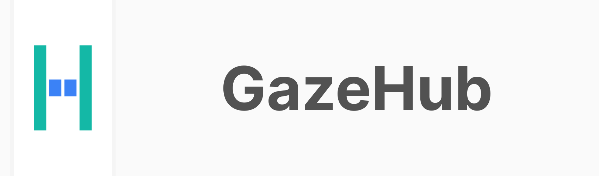

[](https://github.com/isaaceindhoven/GazeHub-src/actions/workflows/CI.yml) [](https://badge.fury.io/ph/isaac%2Fgaze-hub)

GazeHub is part of [Gaze](https://isaaceindhoven.github.io/GazeHub/docs).
GazeHub is the main server that is responsible for sending data from the backend to the frontend.

## Documentation
[Click here](https://isaaceindhoven.github.io/GazeHub/docs) to go to the documentation.

## Run as standalone project
```shell script
./gazehub
```

## Run as composer dependency
```shell script
./vendor/bin/gazehub
```

## Build new release
```shell script
./release.sh
```

This script will do the following steps:
1. Clone [GazeHub-src](https://github.com/isaaceindhoven/GazeHub-src) into `gazehub-src`.
1. Run `composer install`.
1. Create a new `gazehub.phar` and move it to the right place.
1. Remove the cloned `gazehub-src` folder.
1. Stage newly created phar file.

## Source code
The main code for this repository can be found at [GazeHub-src](https://github.com/isaaceindhoven/GazeHub-src)