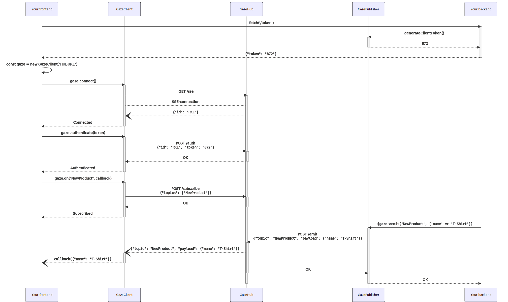

# Complete install

It can be a bit daunting to get a grasp of how all of Gaze comes together. On this page we will walk you through a generic PHP example. Before following the tutorial make sure you have the following tools installed: **PHP 7.3** or higher, **NPM**, **Composer** and **OpenSSL**.

### Installing GazeHub and GazePublisher
```bash
composer require isaac/gaze-hub isaac/gaze-publisher
```

### Public/Private keypair

Run in your project root:
```bash
# Generate private key
openssl genrsa -out private.key 4096

# Extract public key from private key
openssl rsa -in private.key -outform PEM -pubout -out public.key
```

!> Make sure the **private key** never leaves the machine it will be used on and the keys are added to the `.gitignore` file.

### GazeHub configuration
Create a `gazehub.config.json` file in your project root with the following contents.
```json
{
    "port": 3333,
    "host": "0.0.0.0"
}
```

?> Take a look at the [GazeHub](gazehub) page for more configuration options.

### GazePublisher configuration

Creating a new instance of GazePublisher:

```php
use ISAAC\GazePublisher\GazePublisher;

$gaze = new GazePublisher('http://0.0.0.0:3333', file_get_contents('private.key'));
```

### Providing the token to the client

GazeHub has no clue about your backend authorization. The user (browser) needs to connect with GazeHub using a JWT that has been provided by the backend. You can inject the token using a templating engine or using a `/token` endpoint. In the example we will use a `/token` endpoint.

```php
// @route('/token')
public function token(Request $request)
{
    $roles = $request->user()->getRoles(); // ['admin', 'sales']
    return new Response(json_encode(['token' => $this->gaze->generateClientToken($roles)]));
}

```

### Installing GazeClient

You can use GazeClient via a CDN or running `npm install @isaac.frontend/gaze-client`. We will take the CDN approach.

```html
<script src="https://unpkg.com/@isaac.frontend/gaze-client/dist/GazeClient.js"></script>
```

```js
// get the JWT from the backend
const tokenRequest = await fetch('/token');
const tokenRequestJson = await tokenRequest.json();

// connect to gaze
const gaze = new GazeClient('http://localhost:3333/');
await gaze.connect();
await gaze.authenticate(tokenRequestJson.token);
```

### Run GazeHub

Great! We can now start GazeHub by running the command `GAZEHUB_JWT_PUBLIC_KEY=$(cat public.key) ./vendor/bin/gazehub`.

?> Take a look at the [GazeHub](gazehub) page if you want to start GazeHub using Docker, Supervisor or systemd.

### Subscribing to a topic

We will finish by subscribing to a topic and receiving its emit payload from the backend.

```js
gaze.on('ProductCreated', product => {
    alert(`New product ${product.name} added`);
});
```

```php
// @route('/product', 'post')
public function product(Request $request){
    $product = $this->productRepo()->save($request->data());
    %$this->gaze->emit('ProductCreated', $product);
    return $product;
}
```

### The full picture

Below is a diagram that visualizes the whole data flow between the libraries, your browser and your backend.

